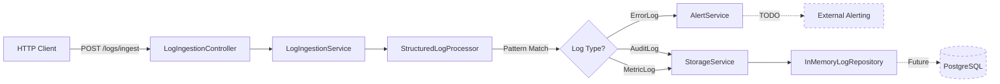

# 🚀 Ghost Logger

[](https://openjdk.org/projects/jdk/21/)
[](https://spring.io/projects/spring-boot)
[](https://opensource.org/licenses/Apache-2.0)

**Experimental project demonstrating the outcomes of GitHub Copilot custom coding agents**. Showcases Virtual Threads, Sealed Interfaces, Structured Concurrency, and Hexagonal Architecture patterns.

> ⚠️ **Project Status**: Experimental / Proof of Concept  
> Not production-ready. In-memory storage only. No authentication or persistence layer.

---

## 📋 Table of Contents

- [Purpose](#purpose)
- [What's Implemented](#whats-implemented)
- [Architecture](#architecture)
- [Technology Stack](#technology-stack)
- [Quick Start](#quick-start)
- [API Endpoints](#api-endpoints)
- [Development Roadmap](#development-roadmap)
- [Documentation](#documentation)
- [Contributing](#contributing)
- [License](#license)

---

## 🎯 Purpose

This project demonstrates modern Java development patterns:

1. **Java 21 Features**: Virtual Threads, Sealed Interfaces, Records, Pattern Matching
2. **Hexagonal Architecture**: Clean separation of domain, API, and infrastructure layers
3. **Type-Safe Design**: Sealed interfaces eliminate runtime classification errors
4. **Structured Concurrency**: Parallel processing with `StructuredTaskScope` (Preview Feature)

**Target Audience**: Java developers learning modern language features and architectural patterns.

---

## ✅ What's Implemented

### Core Features
- ✅ **REST API**: Batch log ingestion endpoint `POST /api/v1/logs/ingest`
- ✅ **Domain Models**: Sealed interface `LogEntry` with `ErrorLog`, `AuditLog`, `MetricLog` implementations
- ✅ **Hexagonal Ports**: Clean interfaces (`LogRepository`, `StorageService`, `AlertService`)
- ✅ **Virtual Threads**: Enabled via `spring.threads.virtual.enabled=true`
- ✅ **Structured Concurrency**: Parallel log processing with `StructuredTaskScope` (Java 21 Preview)
- ✅ **Pattern Matching**: Type-safe log processing with switch expressions
- ✅ **OpenAPI 3.0**: Auto-generated Swagger UI at `/swagger-ui.html`
- ✅ **Spring Actuator**: Health check endpoint at `/actuator/health`
- ✅ **Rate Limiting**: Basic `@RateLimiter` annotation (configured but basic implementation)

### Infrastructure
- ✅ **In-Memory Storage**: `ConcurrentHashMap`-based repository for demo purposes
- ✅ **Docker Compose**: PostgreSQL container configuration (not integrated yet)
- ✅ **Resilience4j Config**: Rate limiter and circuit breaker configuration present

### 🚧 What's NOT Yet Implemented
- ❌ **Database Persistence**: Using in-memory storage only (no JPA/PostgreSQL integration)
- ❌ **Circuit Breaker**: Configuration exists but not applied to external calls
- ❌ **Distributed Tracing**: `TraceContext` model exists but not integrated with Zipkin/Jaeger
- ❌ **Authentication**: No OAuth2/JWT implementation
- ❌ **Integration Tests**: No Testcontainers tests present
- ❌ **Performance Benchmarks**: No load testing or metrics collection
- ❌ **Flyway Migrations**: No database schema versioning

---

## 🏛️ Architecture

### High-Level Design



*Note: Dashed lines indicate planned features not yet implemented*

### Package Structure (Hexagonal Layers)

```
com.ghostlogger
├── api/                       # 🌐 API Layer (Inbound Adapters)
│   ├── controller/            # REST Controllers (Spring MVC)
│   ├── dto/                   # Data Transfer Objects (Records)
│   └── exception/             # Global Exception Handlers
│
├── domain/                    # 💎 Domain Layer (Core Business Logic)
│   ├── model/                 # Domain Models (Sealed Interfaces, Records)
│   ├── port/                  # Ports (Interfaces for Adapters)
│   └── service/               # Domain Services (Pure Java Logic)
│
└── infrastructure/            # 🔌 Infrastructure Layer (Outbound Adapters)
    ├── adapter/               # Adapter Implementations (DB, External APIs)
    └── config/                # Spring Configuration
```

**Architectural Decision Records (ADRs)**: See [DEVELOPMENT.md](DEVELOPMENT.md#architectural-decisions) for detailed rationale.

---

## 🛠️ Technology Stack

### Core Framework
| Technology | Version | Purpose |
|------------|---------|---------|
| **Java** | 21 | Virtual Threads, Sealed Classes, Pattern Matching |
| **Spring Boot** | 3.2.1 | Dependency Injection, REST Framework |
| **PostgreSQL** | 16 | Relational Data Storage |
| **Resilience4j** | 2.2.0 | Circuit Breaker, Rate Limiter, Retry |

### Additional Libraries
- **Lombok** `1.18.34`: Boilerplate reduction
- **SpringDoc OpenAPI** `2.3.0`: API documentation
- **Testcontainers** `1.19.x`: Integration testing with Docker

### Build & Deployment
- **Maven** `3.9+`: Dependency management
- **Docker Compose**: Local development environment

---

## ⚡ Quick Start

### Prerequisites
- **Java 21+** (with preview features enabled)
- **Maven 3.9+**
- **Docker & Docker Compose**

### 60-Second Setup

```bash
# 1. Clone the repository
git clone <your-repository-url>
cd ghost-logger

# 2. Build and run (PostgreSQL not required - using in-memory storage)
mvn clean package -DskipTests
mvn spring-boot:run

# 3. Test the API
curl -X POST http://localhost:8080/api/v1/logs/ingest \
  -H "Content-Type: application/json" \
  -d '{
    "entries": [
      {
        "type": "ERROR",
        "message": "Database connection timeout",
        "severity": "HIGH",
        "exceptionClass": "java.sql.SQLException",
        "stackTrace": "at com.example.DB.connect(...)"
      }
    ]
  }'
```

**Expected Response:**
```json
{
  "batchId": "a3b5c7d9-1234-5678-90ab-cdef12345678",
  "status": "ACCEPTED",
  "processedCount": 1,
  "timestamp": "2025-12-26T10:30:00Z"
}
```

---

## 🌐 API Endpoints

| Method | Endpoint | Description | Status Code |
|--------|----------|-------------|-------------|
| `POST` | `/api/v1/logs/ingest` | Batch log ingestion | `202 Accepted` |
| `GET` | `/api/v1/health` | Health check | `200 OK` |
| `GET` | `/swagger-ui.html` | Interactive API docs | `200 OK` |
| `GET` | `/actuator/health` | Spring Actuator health | `200 OK` |
| `GET` | `/actuator/prometheus` | Prometheus metrics | `200 OK` |

### Sample Requests

<details>
<summary><strong>POST /api/v1/logs/ingest</strong> - Batch Ingestion</summary>

```bash
curl -X POST http://localhost:8080/api/v1/logs/ingest \
  -H "Content-Type: application/json" \
  -d '{
    "entries": [
      {
        "type": "AUDIT",
        "message": "User login successful",
        "userId": "user-123",
        "action": "LOGIN",
        "resource": "/api/auth/login",
        "ipAddress": "192.168.1.100"
      },
      {
        "type": "METRIC",
        "message": "Request latency recorded",
        "metricName": "http.request.duration",
        "metricValue": 125.5,
        "unit": "milliseconds"
      }
    ]
  }'
```
</details>

**Interactive Documentation**: Visit [http://localhost:8080/swagger-ui.html](http://localhost:8080/swagger-ui.html) after starting the application.

---

## 📊 Observability

### Health Checks
```bash
# Basic health check
curl http://localhost:8080/api/v1/health

# Spring Actuator health
curl http://localhost:8080/actuator/health
```

### Metrics
```bash
# Available actuator endpoints
curl http://localhost:8080/actuator

# JVM metrics
curl http://localhost:8080/actuator/metrics/jvm.threads.live
```

### Distributed Tracing (Planned)
`TraceContext` model exists in codebase but not yet integrated with external tracing systems:
```java
// Currently logs trace context locally
TraceContext context = TraceContext.current();
log.info("Processing log [traceId={}]", context.traceId());
```

---

## �️ Development Roadmap

### Phase 1: Foundation (✅ Complete)
- [x] Hexagonal architecture setup
- [x] Sealed interfaces for log types
- [x] Virtual Threads enabled
- [x] Structured Concurrency (Preview)
- [x] OpenAPI documentation
- [x] In-memory storage

### Phase 2: Persistence (📋 Planned)
- [ ] PostgreSQL integration with JPA
- [ ] Flyway database migrations
- [ ] Entity mappings for log types
- [ ] Connection pooling optimization

### Phase 3: Resilience (📋 Planned)
- [ ] Implement circuit breakers for external calls
- [ ] Add retry logic with exponential backoff
- [ ] Rate limiting per client
- [ ] Bulkhead patterns

### Phase 4: Observability (📋 Planned)
- [ ] Distributed tracing (Zipkin/Jaeger)
- [ ] Prometheus metrics
- [ ] Custom business metrics
- [ ] Performance benchmarking

### Phase 5: Security (📋 Planned)
- [ ] OAuth 2.0 / JWT authentication
- [ ] Role-based access control
- [ ] API key management
- [ ] TLS/HTTPS configuration

---

## 📚 Documentation

- **[DEVELOPMENT.md](DEVELOPMENT.md)**: Local setup, testing, architecture decisions
- **[TROUBLESHOOTING.md](TROUBLESHOOTING.md)**: Common errors and solutions
- **[API_IMPLEMENTATION.md](API_IMPLEMENTATION.md)**: REST API design rationale
- **OpenAPI Spec**: Available at `/api-docs` when running the application

---

## 🤝 Contributing

We follow **Conventional Commits** and **Git Flow**:

```bash
# Feature branch
git checkout -b feat/add-kafka-adapter

# Commit with semantic prefix
git commit -m "feat: add Kafka log streaming adapter"

# Pull request to develop branch
git push origin feat/add-kafka-adapter
```

**Commit Types**: `feat`, `fix`, `docs`, `refactor`, `test`, `chore`

See [DEVELOPMENT.md - Contributing](DEVELOPMENT.md#contributing) for code style and PR guidelines.

---

## 📄 License

Licensed under the **Apache License 2.0**. See [LICENSE](LICENSE) file for details.

---

---

**Experimental project demonstrating the outcomes of GitHub Copilot custom coding agents**

For questions or contributions, please open an issue in the repository.
- `404 Not Found` - Resource not found
- `422 Unprocessable Entity` - Business logic validation error
- `429 Too Many Requests` - Rate limit exceeded

### Idempotency
- `GET`, `PUT`, `DELETE` are idempotent
- `POST` with Idempotency-Key header for non-idempotent operations

### Pagination & Filtering
- Use query parameters: `?page=0&size=20`
- Return metadata in responses

## Resilience Patterns

### Circuit Breaker (Resilience4j)
Protects against cascading failures when external services are down.

```yaml
resilience4j.circuitbreaker:
  instances:
    ghostLoggerService:
      failureRateThreshold: 50
      waitDurationInOpenState: 10s
```

### Rate Limiting
Prevents API abuse by limiting requests per time window.

```yaml
resilience4j.ratelimiter:
  instances:
    ghostLoggerApi:
      limitForPeriod: 100
      limitRefreshPeriod: 1s
```

## Testing Strategy

### Unit Tests
Test domain logic in isolation:
```bash
mvn test
```

### Integration Tests with Testcontainers
Test with real PostgreSQL database:
```bash
mvn verify
```

## Database Schema

The project uses PostgreSQL. Schema migrations can be managed with:
- **Flyway** (recommended for production)
- **Liquibase** (alternative)

## Future Enhancements

- [ ] JPA Entity implementation for PostgreSQL persistence
- [ ] Flyway migrations for database versioning
- [ ] JWT/OAuth2 authentication
- [ ] HATEOAS links for resource navigation
- [ ] ETag support for caching
- [ ] Kafka integration for async log streaming
- [ ] Metrics & Distributed Tracing (Micrometer/Zipkin)

## Contributing

Follow these guidelines:
1. Use Java 21 Records for immutable DTOs
2. Constructor injection only (no `@Autowired` on fields)
3. Keep domain logic framework-agnostic
4. Write integration tests with Testcontainers
5. Document all public APIs with OpenAPI annotations

## License

Apache 2.0
