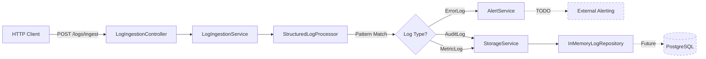

# 🚀 Ghost Logger

[](https://openjdk.org/projects/jdk/21/)
[](https://spring.io/projects/spring-boot)
[](https://opensource.org/licenses/Apache-2.0)

**Experimental project demonstrating the outcomes of GitHub Copilot custom coding agents**. 

> ⚠️ **Project Status**: Experimental / Proof of Concept  
> Not production-ready. In-memory storage only. No authentication or persistence layer.

---

## 📋 Table of Contents

- [Purpose](#purpose)
- [What's Implemented](#whats-implemented)
- [Architecture](#architecture)
- [Technology Stack](#technology-stack)
- [Quick Start](#quick-start)
- [API Endpoints](#api-endpoints)
- [Development Roadmap](#development-roadmap)
- [Documentation](#documentation)
- [Contributing](#contributing)
- [License](#license)

---

## 🎯 Purpose

This project demonstrates modern Java development patterns as an outcome of GitHub Copilot custom coding agents. It serves as a learning resource and example project to showcase how Copilot can assist in:

1. **Accelerating Development**: Automating repetitive tasks and generating boilerplate code.
2. **Enhancing Productivity**: Providing intelligent suggestions for complex implementations.
3. **Exploring Modern Java Features**: Virtual Threads, Sealed Interfaces, Records, Pattern Matching.
4. **Architectural Patterns**: Implementing Hexagonal Architecture with clean separation of concerns.

**Target Audience**: Java developers and enthusiasts exploring the potential of AI-assisted development tools like GitHub Copilot.

---

## ✅ What's Implemented

### Core Features
- ✅ **REST API**: Batch log ingestion endpoint `POST /api/v1/logs/ingest`
- ✅ **Domain Models**: Sealed interface `LogEntry` with `ErrorLog`, `AuditLog`, `MetricLog` implementations
- ✅ **Hexagonal Ports**: Clean interfaces (`LogRepository`, `StorageService`, `AlertService`)
- ✅ **Virtual Threads**: Enabled via `spring.threads.virtual.enabled=true`
- ✅ **Structured Concurrency**: Parallel log processing with `StructuredTaskScope` (Java 21 Preview)
- ✅ **Pattern Matching**: Type-safe log processing with switch expressions
- ✅ **OpenAPI 3.0**: Auto-generated Swagger UI at `/swagger-ui.html`
- ✅ **Spring Actuator**: Health check endpoint at `/actuator/health`
- ✅ **Rate Limiting**: Basic `@RateLimiter` annotation (configured but basic implementation)
- ✅ **Custom Logback Appender**: Demonstrates Copilot-assisted implementation of a custom Logback appender for sending logs to a server endpoint using Java 21 virtual threads.

### Infrastructure
- ✅ **In-Memory Storage**: `ConcurrentHashMap`-based repository for demo purposes
- ✅ **Docker Compose**: PostgreSQL container configuration (not integrated yet)
- ✅ **Resilience4j Config**: Rate limiter and circuit breaker configuration present

### 🚧 What's NOT Yet Implemented
- ❌ **Database Persistence**: Using in-memory storage only (no JPA/PostgreSQL integration)
- ❌ **Circuit Breaker**: Configuration exists but not applied to external calls
- ❌ **Distributed Tracing**: `TraceContext` model exists but not integrated with Zipkin/Jaeger
- ❌ **Authentication**: No OAuth2/JWT implementation
- ❌ **Integration Tests**: No Testcontainers tests present
- ❌ **Performance Benchmarks**: No load testing or metrics collection
- ❌ **Flyway Migrations**: No database schema versioning

---

## 🏛️ Architecture

### High-Level Design



*Note: Dashed lines indicate planned features not yet implemented*

### Package Structure (Hexagonal Layers)

```
com.ghostlogger
├── api/                       # 🌐 API Layer (Inbound Adapters)
│   ├── controller/            # REST Controllers (Spring MVC)
│   ├── dto/                   # Data Transfer Objects (Records)
│   └── exception/             # Global Exception Handlers
│
├── domain/                    # 💎 Domain Layer (Core Business Logic)
│   ├── model/                 # Domain Models (Sealed Interfaces, Records)
│   ├── port/                  # Ports (Interfaces for Adapters)
│   └── service/               # Domain Services (Pure Java Logic)
│
└── infrastructure/            # 🔌 Infrastructure Layer (Outbound Adapters)
    ├── adapter/               # Adapter Implementations (DB, External APIs)
    └── config/                # Spring Configuration
```

**Architectural Decision Records (ADRs)**: See [DEVELOPMENT.md](DEVELOPMENT.md#architectural-decisions) for detailed rationale.

---

## 🛠️ Technology Stack

### Core Framework
| Technology | Version | Purpose |
|------------|---------|---------|
| **Java** | 21 | Virtual Threads, Sealed Classes, Pattern Matching |
| **Spring Boot** | 3.2.1 | Dependency Injection, REST Framework |
| **PostgreSQL** | 16 | Relational Data Storage |
| **Resilience4j** | 2.2.0 | Circuit Breaker, Rate Limiter, Retry |

### Additional Libraries
- **Lombok** `1.18.34`: Boilerplate reduction
- **SpringDoc OpenAPI** `2.3.0`: API documentation
- **Testcontainers** `1.19.x`: Integration testing with Docker

### Build & Deployment
- **Maven** `3.9+`: Dependency management
- **Docker Compose**: Local development environment

---


## ⚡ Quick Start

### Client Sample Usage

You can use the `ghost-logger-client-sample` module to ship logs from any Java application to the Ghost Logger server via HTTP using a resilient, non-blocking Logback appender.

### 🚦 How to Run the Client Sample

1. **Start the Ghost Logger server** (in a separate terminal):
  ```bash
  mvn -pl ghost-logger-server spring-boot:run
  ```

2. **Build the client sample module:**
  ```bash
  mvn clean package -pl ghost-logger-client-sample -DskipTests
  ```

3. **Run the client sample app:**
  ```bash
  java --enable-preview -cp ghost-logger-client-sample/target/ghost-logger-client-sample-1.0.0-SNAPSHOT.jar com.ghostlogger.client.ClientSampleApp
  ```

  - The `--enable-preview` flag is required for Java 21 virtual threads.
  - You should see log output in the server console and successful ingestion responses.

4. **Verify logs on the server:**
  - Check the Ghost Logger server logs or use the API to confirm logs were received.

---


### Prerequisites
- **Java 21+** (with preview features enabled)
- **Maven 3.9+**
- **Docker & Docker Compose**

### 60-Second Setup

```bash
# 1. Clone the repository
git clone <repository-url>
cd ghost-logger

# 2. Build and run (PostgreSQL not required - using in-memory storage)
mvn clean package -DskipTests
mvn spring-boot:run

# 3. Test the API
curl -X POST http://localhost:8080/api/v1/logs/ingest \
  -H "Content-Type: application/json" \
  -d '{
    "logs": [
      {
        "type": "ERROR",
        "message": "Database connection timeout",
        "source": "app-server-1",
        "severity": "ERROR",
        "exceptionType": "java.sql.SQLException",
        "stackTrace": "at com.example.DB.connect(...)"
      }
    ]
  }'
```

**Expected Response:**
```json
{
  "batchId": "a3b5c7d9-1234-5678-90ab-cdef12345678",
  "status": "ACCEPTED",
  "processedCount": 1,
  "timestamp": "2025-12-26T10:30:00Z"
}
```

---

## 🌐 API Endpoints

| Method | Endpoint | Description | Status Code |
|--------|----------|-------------|-------------|
| `POST` | `/api/v1/logs/ingest` | Batch log ingestion | `202 Accepted` |
| `GET` | `/api/v1/health` | Health check | `200 OK` |
| `GET` | `/swagger-ui.html` | Interactive API docs | `200 OK` |
| `GET` | `/actuator/health` | Spring Actuator health | `200 OK` |
| `GET` | `/actuator/prometheus` | Prometheus metrics | `200 OK` |

### Sample Requests

<details>
<summary><strong>POST /api/v1/logs/ingest</strong> - Batch Ingestion</summary>

```bash
curl -X POST http://localhost:8080/api/v1/logs/ingest \
  -H "Content-Type: application/json" \
  -d '{
    "logs": [
      {
        "type": "AUDIT",
        "message": "User login successful",
        "userId": "user-123",
        "action": "LOGIN",
        "resource": "/api/auth/login",
        "ipAddress": "192.168.1.100"
      },
      {
        "type": "METRIC",
        "message": "Request latency recorded",
        "metricName": "http.request.duration",
        "metricValue": 125.5,
        "unit": "milliseconds"
      }
    ]
  }'
```
</details>

**Interactive Documentation**: Visit [http://localhost:8080/swagger-ui.html](http://localhost:8080/swagger-ui.html) after starting the application.

---

## 📊 Observability

### Health Checks
```bash
# Basic health check
curl http://localhost:8080/api/v1/health

```
---

## 🛠️ Development Roadmap

### Community Engagement

This project is an experimental showcase of GitHub Copilot's capabilities. We encourage the community to:

- **Experiment**: Use GitHub Copilot to extend the project with new features or refactor existing code.
- **Contribute**: Share your enhancements, bug fixes, or creative ideas through pull requests.
- **Learn**: Explore how Copilot assists in implementing modern Java features and architectural patterns.

### Get Involved

- Fork the repository and try adding a new feature using GitHub Copilot.
- Share your experience and insights with the community.
- Help improve the project by reporting issues or suggesting improvements.

Together, let's explore the potential of AI-assisted development!

---

## 📚 Documentation

- **[DEVELOPMENT.md](DEVELOPMENT.md)**: Local setup, testing, architecture decisions
- **OpenAPI Spec**: Available at `/api-docs` when running the application

---

## 🤝 Contributing

We follow **Conventional Commits** and **Git Flow**:

```bash
# Feature branch
git checkout -b feat/add-kafka-adapter

# Commit with semantic prefix
git commit -m "feat: add Kafka log streaming adapter"

# Pull request to develop branch
git push origin feat/add-kafka-adapter
```

**Commit Types**: `feat`, `fix`, `docs`, `refactor`, `test`, `chore`

See [DEVELOPMENT.md - Contributing](DEVELOPMENT.md#contributing) for code style and PR guidelines.

---

## 📄 License

Licensed under the **Apache License 2.0**. See [LICENSE](LICENSE) file for details.

---

## ⚠️ Disclaimer

All code in this project has been generated by AI using GitHub Copilot. While every effort has been made to ensure functionality and accuracy, this project is intended as an experimental showcase of AI-assisted development. Use at your own discretion.